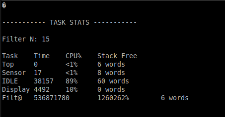
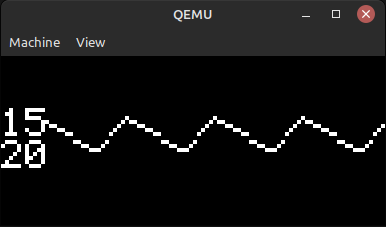
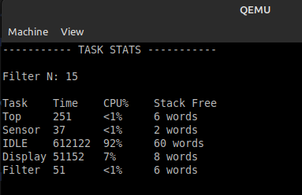
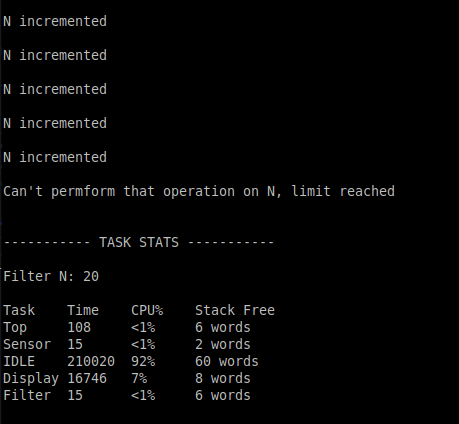
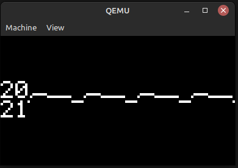
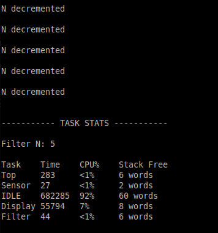
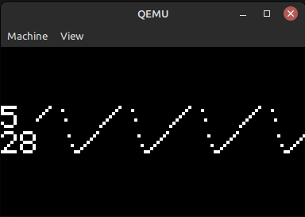

# SOII TP7: Sistemas Operativos de Tiempo Real

## Introducción
El proyecto incluye una aplicación basada en FreeRTOS, a partir de la Demo *CORTEX_LM3S811_GCC*, para la placa *Stellaris LM3S811*, la cual se emula utilizando qemu. A continuación se explican los puntos pedidos en la consigna.

### 1. Task Sensor
La tarea `static void vSensor(void *pvParameters)` simula un sensor de temperatura, genera valores entre `MAX_TEMP = 30` y `MIN_TEMP = 10` [°C].  
La generación de valores se da con una frecuencia de *10Hz*:  
Definimos `#define mainCHECK_DELAY ((TickType_t) 100 / portTICK_PERIOD_MS)`, lo cual se traduce en un delay de 0.1 segundos, y en una frecuencia de 1/0.1 Hz = 10Hz.  
Este delay se aplica en la tarea vSensor, por lo que se ejecuta con esa frecuencia:
```
const TickType_t xDelaySensor = mainCHECK_DELAY;  
vTaskDelay(xDelaySensor);
```
A los valores de temperatura generados, los envía a una cola:
```
xQueueSend(xSensorQueue, &temperature_value, portMAX_DELAY);
```
### 2. Task Filtro
La tarea `static void vFilter(void *pvParameters)` recibe los valores del sensor que están en la cola:
```
xQueueReceive(xSensorQueue, &new_temp_value, portMAX_DELAY);
```
Y aplica un filtro pasa bajos, donde cada valor resultante es el promedio de las ultimas N mediciones. A este valor filtrado, lo envía a una nueva cola
```
xQueueSend(xFilterQueue, &avg_temp, portMAX_DELAY);
```
### 3. Task Display
La tarea `static void vDisplay(void *pvParameters)` grafica en el display los valores de temperatura filtrados en el tiempo.  
Recibe los valores de la cola: `xQueueReceive(xFilterQueue, &new_filtered_value, portMAX_DELAY);`  
Muestra el N del filtro y el valor de temperatura filtrado:
```
OSRAMStringDraw(itoa(filtered_array[i], str, 10), 0, 1);
OSRAMStringDraw(itoa(getN(), str, 10), 0, 0);
```
Como el display tiene 16x96 pixeles, divididos en parte superior e inferior, cada una de 8x96 pixeles, se calcula en que mitad se graficará el valor.
```
int bit_map_half = filtered_array[DISPLAY_COLUMNS - i] >= 20 ? 0 : 1;
```
Luego se grafica el valor en el display, llamando a la función `char* bitMapping(int valor)` que indica el pixel a ser dibujado según el valor de temperatua.
```
OSRAMImageDraw(bitMapping(filtered_array[DISPLAY_COLUMNS - i]), i+10, bit_map_half , 1, 1);
```
**Nota**: se implementó la función `itoa()` de `stdio.h` que convierte un integer en un char para poder graficar en el display.
### 4. N modificable por UART
Se pueden recibir comandos por la interfaz UART para cambiar el N del filtro.  
A la subrutina de interrupción ya definida en la Demo `void vUART_ISR(void)`, se le agrega la recepción de interrupciones por UART basándome en [estos ejemplos](https://cpp.hotexamples.com/es/examples/-/-/UARTIntClear/cpp-uartintclear-function-examples.html) 
Los comandos que se pueden recibir son:
 - **+** (incrementa en 1 el N)
 - **-** (decrementa en 1 el N)  

El valor de N puede ser modificado mientras se mantenga dentro del rango válido, ente el valor máximo y mínimo permitido, sino imprimirá un mensaje de alerta y no modificará el N.
### 5. Task Top
La tarea `static void vTop(void *pvParameters)` muestra periódicamente estadísticas de las tareas. Para esto me basé en la tarea [uxTaskGetSystemState de freertos.org](https://www.freertos.org/uxTaskGetSystemState.html).
Las estadísticas que se muestran son:
- Cantidad de Ticks - `pxTaskStatusArray[x].ulRunTimeCounter`
- Porcentage de uso de CPU - `ulStatsAsPercentage = pxTaskStatusArray[x].ulRunTimeCounter / ulTotalRunTime;`
- El stack free que queda - `uxTaskGetStackHighWaterMark(pxTaskStatusArray[x].xHandle`  

Esto se envía por UART y se imprime por la interfaz en un formato de tabla.
### 6. Cálculo del Stack
A partir del stack free que podemos ver utilizando `uxTaskGetStackHighWaterMark` en la tabla de estadísticas, fui modificando en el archivo *FreeRTOSConfig.h* los tamaños del Stack de cada tarea para que el stack free sea el menor posible sin llegar a cero, ya que eso significaría un posible overflow. [Docu uxTaskGetStackHighWaterMark](
https://www.freertos.org/uxTaskGetStackHighWaterMark.html )
```
#define configSENSOR_STACK_SIZE   ((unsigned short) (38))
#define configFILTER_STACK_SIZE   ((unsigned short) (62))
#define configDISPLAY_STACK_SIZE  ((unsigned short) (145))
#define configTOP_STACK_SIZE      ((unsigned short) (56))
```
#### 6.1. El overflow en acción
Vamos a disminuir el stack de la tarea *vDisplay*, pero muy poco:
```
#define configDISPLAY_STACK_SIZE  ((unsigned short) (130))
```
Ejecutando el programa vemos que funciona casi perfectamente, salvo por esta impresión en la tabla de estadísticas, lo que significa que la tarea del Display está pisando el stack de la tarea del Filtro debido a que no le dimos suficiente stack. Además, el stack free = 0 words nos indica que hay overflow.  


Ahora vamos a disminuirlo en mayor cantidad:
```
#define configDISPLAY_STACK_SIZE  ((unsigned short) (50))
```
Directamente el programa crashea.

### Ejecución
1. Clonar este repo dentro de la carpeta "Demo"
2. `make`
3. `qemu-system-arm -machine lm3s811evb -kernel gcc/RTOSDemo.axf`

### Funcionamiento
Al ejecutar, lo primero que vemos es la vista del display con un N=15 y el gráfico de la temperatura filtrada.   
  
En la ventana serial, vemos las estadisticas enviadas por UART por la tarea Top   
  
Incrementamos el N hasta el límite 20, enviando por UART el caracter "+":  
  
  
Enviando el caracter "-", decrementamos el N hasta 5:  
  



### Datasheet
 - [Stellaris LM3S811](https://www.ti.com/lit/ug/spmu030b/spmu030b.pdf?ts=1701896176160)